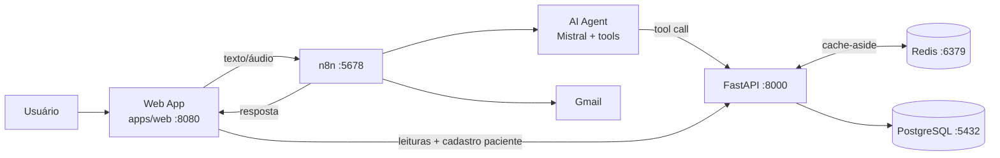
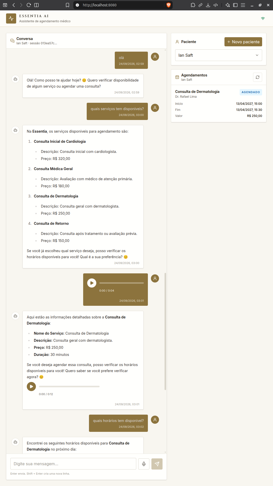

# Essentia AI Medical Scheduling Assistant

Assistente de agendamento médico com interface conversacional (texto e áudio), orquestrado por **n8n** com AI Agent, API **FastAPI** determinística, **PostgreSQL** como fonte de verdade transacional e **Redis** como cache de disponibilidade e memória conversacional.

> O modelo de IA interpreta intenção e linguagem natural; o workflow orquestra integrações; a API governa regras de negócio; o banco garante invariantes finais de consistência.

## Arquitetura



| Serviço | Porta | Papel |
|---|---|---|
| `web` | `8080` | SPA React servida por nginx |
| `api` | `8000` | FastAPI — regras de domínio, REST, OpenAPI |
| `n8n` | `5678` | Orquestração conversacional, STT/TTS, e-mail |
| `postgres` | `5432` | Fonte de verdade transacional |
| `redis` | `6379` | Cache de disponibilidade (API, DB 0) + memória/estado do n8n (DB 1) |

Documentação detalhada: [`docs/README.md`](./docs/README.md).

## Pré-requisitos

- **Docker** + **Docker Compose** (v2+)
- Conta na **[Mistral](https://console.mistral.ai/)** — API Key (LLMs, STT e TTS usados pelo workflow)
- Conta no **[OpenRouter](https://openrouter.ai/)** — API Key (modelo fallback conectado ao agent)
- **Google Cloud Project** com Gmail API + OAuth2 (opcional, apenas para e-mails de confirmação)
- `make` e `uv`/`node` apenas se for rodar componentes fora do Docker (opcional)

## Get Started (Docker — recomendado)

### 1. Clonar e configurar o ambiente

```bash
git clone <repo-url>
cd essentia_ai_medical_scheduling_assistant

cp .env.example .env
```

Edite o `.env` e defina **antes do primeiro `docker compose up`**:

| Variável | O que fazer |
|---|---|
| `PG_SUPERUSER_PW` | Gere uma senha forte |
| `API_DB_PW` | Coloque a **mesma** senha de `PG_SUPERUSER_PW` |
| `REDIS_PASSWORD` | Gere uma senha forte |
| `API_REDIS_PASSWORD` | Coloque a **mesma** senha de `REDIS_PASSWORD` |
| `N8N_ENCRYPTION_KEY` | **Obrigatória** — gere 32+ bytes hex (ex.: `openssl rand -hex 32`). Defina uma vez e não troque depois (trocar quebra credenciais salvas no n8n) |
| `VITE_N8N_CHAT_WEBHOOK_URL` | `http://localhost:5678/webhook/essentia-ia-assistent` (webhook de produção do workflow) |

> **Importante:** `VITE_N8N_CHAT_WEBHOOK_URL` e `VITE_API_BASE_URL` são *build args* da imagem web. Elas precisam estar corretas no `.env` **antes** de construir (ou você reconstrói com `docker compose build web` depois de alterar).

### 2. Subir a stack

```bash
docker compose up -d --build
```

Ordem garantida por healthchecks/`depends_on`:

```text
PostgreSQL healthy → migrations → seeds → Redis healthy → FastAPI → n8n → web
```

Aguarde tudo ficar healthy:

```bash
docker compose ps
curl http://localhost:8000/health         # {"status":"ok"}
curl http://localhost:8000/health/n8n     # {"status":"ok"} quando o n8n estiver pronto
```

### 3. Configurar o n8n (uma vez)

1. Acesse **http://localhost:5678** e crie a conta do owner (owner account).
2. Importe o workflow: **Workflows → Import from File** → selecione [`essentia-ai-medical-scheduling-assistant-n8n-workflow.json`](./essentia-ai-medical-scheduling-assistant-n8n-workflow.json).
3. Crie e vincule as credenciais abaixo (o export importa com nós em vermelho até você associá-las).
4. **Ative o workflow** (toggle no topo — o export vem com `active: false`). Com o workflow ativo, o webhook de produção fica em `POST http://localhost:5678/webhook/essentia-ia-assistent` (CORS já permite `http://localhost:8080`).

#### Credenciais necessárias

| Credencial no n8n | Tipo | Onde obter / valores | Nodes afetados |
|---|---|---|---|
| **Redis account** | Redis | Host: `redis` · Porta: `6379` · Senha: `REDIS_PASSWORD` do `.env` · **DB: `1`** (o DB `0` é do cache da API) | Memória conversacional, dedup de e-mail, retries/DLQ |
| **Mistral Cloud account** | API Key | [console.mistral.ai](https://console.mistral.ai/) → API Keys | Agentes LLM (`ministral-3b`), Quality Corrector, STT (`voxtral-mini-latest`), TTS (`voxtral-mini-tts-2603`) |
| **OpenRouter account** | API Key | [openrouter.ai/keys](https://openrouter.ai/keys) | `OpenRouter Chat Model` (fallback do Essentia Scheduling Agent) |
| **Gmail account** | OAuth2 (GCP) | Projeto no [Google Cloud](https://console.cloud.google.com/): habilitar **Gmail API** → OAuth consent screen → **OAuth Client ID** (Web application) → copiar Client ID/Secret e a *Redirect URI* que o n8n exibir ao criar a credencial | Nodes `Send Email - Immediate` / `Send Email - Retry` (confirmações de booking/cancelamento) |

> **Postgres no n8n:** o workflow **não** possui node Postgres — o agente acessa o banco apenas via tools HTTP da FastAPI (`http://api:8000`). As credenciais do PostgreSQL ficam somente no `.env` (`API_DB_*`), consumidas pela API.

> **Gmail é opcional para a demo:** sem a credencial OAuth2, a conversa e os agendamentos funcionam normalmente; apenas os e-mails de confirmação falham (o workflow degrada sem bloquear a resposta ao paciente).

#### Checklist pós-importação

- [ ] Credencial Redis apontando para `redis:6379` com DB `1`
- [ ] Credencial Mistral Cloud vinculada a todos os nós Mistral (agentes, STT, TTS)
- [ ] Credencial OpenRouter vinculada ao nó `OpenRouter Chat Model`
- [ ] (Opcional) Credencial Gmail OAuth2 vinculada aos nós de e-mail
- [ ] Workflow **ativado**
- [ ] `VITE_N8N_CHAT_WEBHOOK_URL` no `.env` apontando para `/webhook/essentia-ia-assistent` (não `/webhook-test/`)

### 4. Acessar a aplicação

| URL | Descrição |
|---|---|
| **http://localhost:8080** | **Aplicação web (interface principal)** |
| http://localhost:8000/docs | Swagger UI da API |
| http://localhost:5678 | Editor do n8n |
| http://localhost:8000/health | Health da API |
| http://localhost:8000/health/n8n | Readiness do n8n |

## Web client

SPA em [`apps/web`](./apps/web) (React + TypeScript + Vite + Tailwind), servida pelo serviço `web` do Compose (nginx).



A interface permite:

- **Selecionar/cadastrar paciente** (modal *Novo paciente* → `POST /v1/patients`, conflito de e-mail/telefone → `409` amigável);
- **Conversar por texto** com o AI Agent via webhook do n8n;
- **Gravar e enviar áudio** (STT via Mistral no workflow; resposta pode incluir TTS);
- **Consultar o histórico de agendamentos** em painel somente leitura (`GET /v1/patients/{id}/appointments`), re-sincronizado após cada turno da conversa.

O frontend não implementa regras de agendamento — conversa vai ao n8n; dados determinísticos vão à FastAPI. Spec completa em [`docs/web-application.md`](./docs/web-application.md) e [`apps/web/README.md`](./apps/web/README.md).

## Dados de demonstração (seeds)

Migrations e seeds rodam automaticamente no primeiro `docker compose up`.

| Entidade | Exemplo |
|---|---|
| Paciente | Maria Silva (`3cdf666b-186d-44e6-bce9-5e572e7038f9`) |
| Médico | Dr. Helena Costa (`0dfc6223-6a11-4d90-a979-bd511bc1d6a9`) |
| Serviço | Cardiology Initial Consultation (`e2fb5edd-efbd-4d60-9de3-d6650e31562f`) — R$ 320,00 |
| Slots futuros | `2027-04-12` e `2027-04-13` (examples do OpenAPI válidos até 2027-04-12) |

Tabela completa (incl. appointment seed `scheduled`): [`apps/api/README.md`](./apps/api/README.md#dados-de-demonstração-seeds).

### Resetar o estado

```bash
docker compose down -v && docker compose up -d --build
# ou, apenas os dados de demonstração (com Postgres local rodando):
make seed-down && make seed-up
```

## Comandos úteis (Makefile)

```bash
make help              # lista todos os alvos

# API (requer uv + Docker para testes com Testcontainers)
make test              # suíte completa com coverage (mín. 85%)
make api-dev           # uvicorn com reload em :8000 (fora do Docker)

# Web (requer Node 24)
make web-check         # typecheck + testes Vitest
make web-dev           # Vite dev server em :5173

# Validação geral
make check             # sqlc + testes da API + web typecheck/testes
```

Testes da API usam Testcontainers (PostgreSQL e Redis descartáveis) e não dependem da stack local — detalhes em [`docs/testing-and-operations.md`](./docs/testing-and-operations.md).

## Estrutura do repositório

```text
.
├── apps/
│   ├── api/                 # FastAPI + sqlc + pytest
│   └── web/                 # SPA React + Vite
├── db/
│   ├── migrations/          # schema (golang-migrate)
│   └── seeds/               # dados de demonstração
├── docs/                    # documentação técnica completa
├── docker-compose.yml       # stack completa
├── Makefile                 # alvos dev/test/migrate
├── .env.example             # template de configuração
└── essentia-ai-medical-scheduling-assistant-n8n-workflow.json
```

## Documentação aprofundada

Para quem quiser ir além do Get Started:

| Documento | Conteúdo |
|---|---|
| [`docs/README.md`](./docs/README.md) | Índice da documentação + estado atual do projeto |
| [`docs/system-requirements.md`](./docs/system-requirements.md) | Escopo, RF e RNF |
| [`docs/architecture.md`](./docs/architecture.md) | Arquitetura, fluxos de booking/cancelamento/disponibilidade |
| [`docs/n8n-workflow-architecture.md`](./docs/n8n-workflow-architecture.md) | Topologia do workflow, resiliência, STT/TTS/e-mail |
| [`docs/business-rules.md`](./docs/business-rules.md) | Regras de domínio (BR-01…BR-38) |
| [`docs/data-model.md`](./docs/data-model.md) | Modelo relacional e invariantes |
| [`docs/design-decisions.md`](./docs/design-decisions.md) | Trade-offs arquiteturais (DD-01…DD-20) |
| [`docs/web-application.md`](./docs/web-application.md) | Spec da aplicação web (WEB-RF/WEB-DD) |
| [`docs/testing-and-operations.md`](./docs/testing-and-operations.md) | Testes, OpenAPI/Postman, observabilidade, operação |
| [`apps/api/README.md`](./apps/api/README.md) | Contrato HTTP completo da API + guia Postman |
| [`apps/web/README.md`](./apps/web/README.md) | Desenvolvimento local do frontend |
| [`apps/web/DESIGN.md`](./apps/web/DESIGN.md) / [`PRODUCT.md`](./apps/web/PRODUCT.md) | Design system e direção de produto |

## Troubleshooting

| Problema | Solução |
|---|---|
| Chat não responde / erro de webhook | Confirme que o workflow está **ativo** e que `VITE_N8N_CHAT_WEBHOOK_URL` usa `/webhook/` (não `/webhook-test/`). Reconstrua: `docker compose build web && docker compose up -d web` |
| Nós do n8n em vermelho | Crie/vincule as credenciais (Redis, Mistral, OpenRouter, Gmail) conforme a tabela acima |
| Credenciais do n8n quebradas após mudar `.env` | `N8N_ENCRYPTION_KEY` não pode mudar depois do primeiro boot; se mudou, apague `.docker/n8n/n8n_data` e reimporta o workflow |
| `GET /health/n8n` retorna `503` | n8n ainda subindo ou não ativo — aguarde `docker compose ps` ficar healthy |
| Slots de demonstração "fora de data" | Os slots futuros das seeds são `2027-04-12/13`; após essa data, revise as seeds |
| Portas em conflito | Ajuste `WEB_PORT`, `API_PORT`, `N8N_PORT`, `PG_PORT`, `REDIS_PORT` no `.env` |
| Recriar tudo do zero | `docker compose down -v --remove-orphans && docker compose up -d --build` |

## Roteiro de demonstração — caminho feliz (para avaliadores)

Roteiro rápido para testar o fluxo completo de agendamento ponta a ponta.

**Pré-condição:** stack ativa e workflow n8n **ativo** com as credenciais configuradas (Redis, Mistral, OpenRouter e **Gmail** — esta última é obrigatória aqui para receber o e-mail de confirmação).

### Passo a passo

1. **Abra a aplicação:** [http://localhost:8080](http://localhost:8080)

2. **Cadastre-se como paciente:**
   - Clique em **+ Novo paciente**;
   - informe seu nome e um **e-mail válido que você acessa** (será para lá que virá a confirmação; telefone é opcional);
   - clique em **Salvar** — o novo paciente é selecionado automaticamente.

3. **Inicie a conversa** no chat, por exemplo:

   ```text
   Olá, gostaria de agendar uma consulta.
   ```

4. **Escolha o serviço** quando a atendente apresentar as opções (ex.: *Consulta Inicial de Cardiologia — R$ 320,00*).

5. **Escolha um horário** da lista de disponibilidade retornada (slots de demonstração: `2027-04-12` e `2027-04-13`).

6. **Confirme o agendamento** quando solicitado e aguarde a confirmação de sucesso na conversa.

7. **Verifique as duas evidências:**
   - o painel **Agendamentos** à direita atualiza sozinho com o novo card `AGENDADO` (sem refresh da página);
   - o **e-mail de confirmação** chega na caixa informada no passo 2 (enviado pela conta Gmail conectada ao n8n).

### O que observar

- O frontend nunca afirma sucesso por conta própria: o painel de histórico só reflete o que a FastAPI/PostgreSQL confirmaram ([`docs/architecture.md`](./docs/architecture.md));
- a criação do agendamento é transacional e idempotente no backend — double booking é impedido pelo banco ([`docs/business-rules.md`](./docs/business-rules.md)).

### Extensões opcionais

- **Áudio:** grave uma mensagem pelo microfone e ouvir a resposta em voz (TTS) no player do chat;
- **Cancelamento:** peça para cancelar a consulta na conversa → o painel muda para `CANCELADO` e um e-mail de cancelamento é enviado;
- **Via API:** abra [http://localhost:8000/docs](http://localhost:8000/docs) e chame `GET /v1/patients/{patient_id}/appointments` com o header `X-Patient-Id` para ver o mesmo estado que o painel exibe.

### Notas

- Use um e-mail **diferente** dos pacientes das seeds (Maria Silva etc.) — repetir um e-mail já cadastrado retorna `409`;
- e-mails de confirmação só disparam após **mutações reais** (`book_appointment` / `cancel_appointment`) — conversas puramente informativas não geram e-mail.
