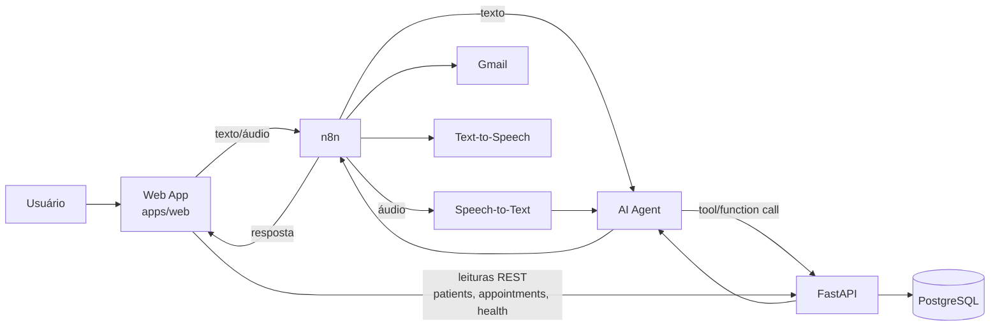
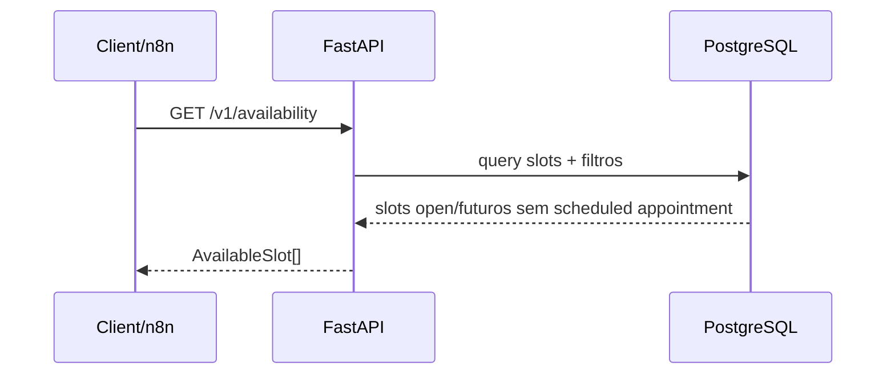
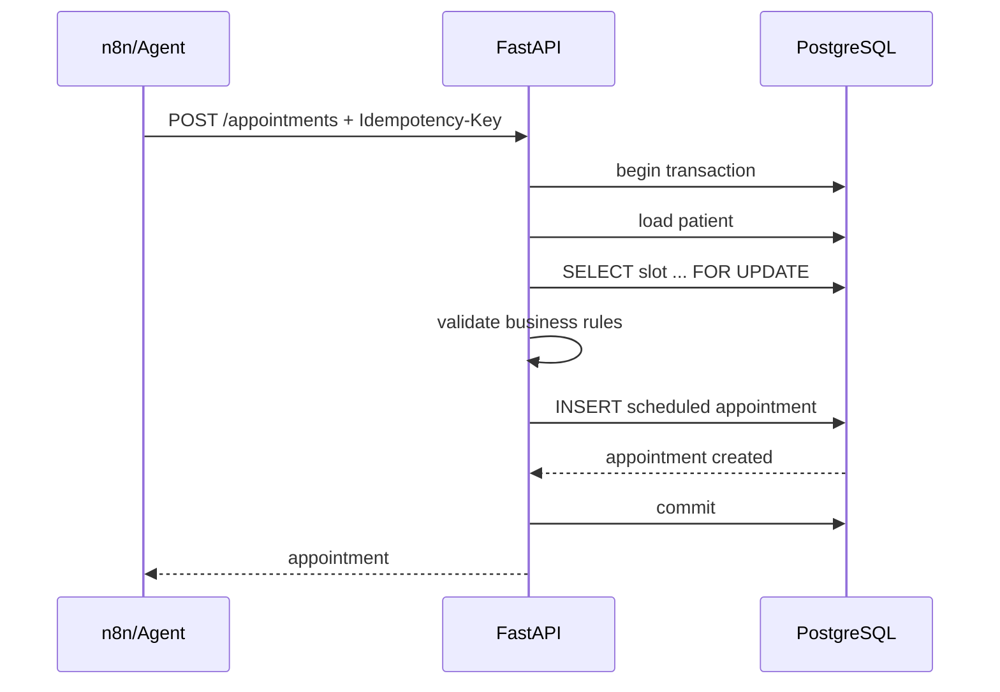

# Arquitetura

## 1. Visão geral

A arquitetura separa claramente interpretação probabilística, orquestração, domínio determinístico e consistência transacional.



A aplicação web é uma camada de apresentação: não implementa regras de agendamento, não decide disponibilidade e não executa mutações de domínio. Conversa (texto/áudio) vai ao n8n; dados determinísticos (seleção de paciente, histórico de agendamentos, health) vão à FastAPI. Detalhes em [`web-application.md`](./web-application.md).

## 2. Responsabilidades por componente

### n8n — orchestration layer

Responsável por:

- receber eventos/mensagens do canal;
- normalizar entrada de texto e áudio;
- executar STT quando necessário;
- manter o fluxo conversacional;
- invocar o AI Agent;
- aplicar retries de integração de maneira controlada;
- chamar Gmail e TTS;
- propagar correlation ID;
- coordenar confirmação humana antes de comandos mutáveis.

O n8n não é a fonte de verdade do domínio.

### AI Agent — interpretation layer

Responsável por:

- entender linguagem natural;
- identificar intenção;
- coletar informações faltantes;
- selecionar a tool adequada;
- produzir respostas naturais a partir de resultados estruturados.

Tools previstas:

- `get_available_slots`;
- `book_appointment`;
- `cancel_appointment`;
- `get_pricing`;
- `get_payment_methods`.

O Agent não acessa o PostgreSQL diretamente.

### FastAPI — application/domain boundary

Responsável por:

- expor o contrato REST;
- validar entrada estrutural;
- executar regras determinísticas;
- controlar transações;
- aplicar idempotência;
- traduzir conflitos de domínio para HTTP;
- consultar persistência SQL tipada;
- expor OpenAPI;
- aplicar CORS restrito às origens do browser configuradas em `API_CORS_ORIGINS`;
- expor liveness (`GET /health`) e readiness do n8n (`GET /health/n8n`);
- controlar o lifecycle da infraestrutura pertencente à instância da aplicação.

A aplicação é criada por uma Application Factory (`create_app`), que recebe configuração explícita quando necessário. O pool de conexões PostgreSQL é criado no lifespan da aplicação e armazenado em `app.state`, evitando estado global de infraestrutura e permitindo isolamento entre diferentes instâncias da API.

### PostgreSQL — transactional source of truth

Responsável por:

- persistir catálogo e agenda;
- garantir integridade referencial;
- evitar slots sobrepostos;
- impedir double booking;
- manter snapshots históricos de preço;
- registrar idempotency requests;
- aplicar constraints como última linha de defesa.

## 3. Persistência

A aplicação não usa ORM.

Stack:

- PostgreSQL 18.x;
- Psycopg 3;
- `psycopg_pool`;
- sqlc para geração de acesso SQL tipado;
- `sqlc-gen-better-python` para código Python;
- `golang-migrate` como único owner de schema e seeds.

Fluxo de ownership:

```text
migrations SQL -> PostgreSQL schema
queries SQL    -> sqlc -> Python generated code
FastAPI        -> generated persistence API
```

Arquivos dentro de `db/generated` são artefatos de code generation e não devem ser editados manualmente.

## 4. Estrutura lógica da API

```text
apps/api/src/essentia_api/
├── api/
│   ├── routes/
│   ├── dependencies.py
│   └── router.py
├── core/
│   └── config.py
├── db/
│   ├── pool.py
│   ├── queries/
│   └── generated/
├── schemas/
├── services/
└── main.py
```

Responsabilidades:

- `api/routes`: adaptação HTTP;
- `api/dependencies.py`: resolução de dependências associadas à instância atual da aplicação, incluindo acesso ao pool via `request.app.state`;
- `schemas`: contratos Pydantic da API;
- `services`: casos de uso e regras transacionais de escrita;
- `db/pool.py`: construção do pool a partir da configuração da aplicação;
- `db/queries`: SQL fonte;
- `db/generated`: persistência gerada;
- `core`: configuração transversal;
- `main.py`: Application Factory e lifecycle da aplicação.

Leituras simples podem usar diretamente queries geradas na route enquanto o projeto permanece pequeno. Operações de escrita e regras multi-etapa devem ficar na camada `services`.

O lifecycle da API segue:

```text
create_app(settings)
       ↓
FastAPI instance
       ↓
lifespan
       ↓
create_connection_pool(settings)
       ↓
app.state.db_pool
       ↓
pool.open()
       ↓
requests
       ↓
pool.close()
```

## 5. Fluxo de consulta de disponibilidade



A disponibilidade não é um campo persistido derivado. Ela é calculada a partir do estado atual de slot + appointment.

## 6. Fluxo de booking



A unique constraint parcial no banco permanece responsável por impedir double booking caso múltiplas execuções concorrentes ultrapassem validações prévias.

## 7. Fluxo de cancelamento

1. n8n identifica intenção de cancelamento;
2. workflow recupera o appointment relevante;
3. usuário confirma explicitamente;
4. API valida que o appointment está `scheduled`;
5. API executa transição para `cancelled`;
6. histórico permanece persistido;
7. workflow envia confirmação externa quando aplicável.

## 8. Boundaries importantes

### IA versus domínio

```text
IA: intenção, linguagem, coleta de contexto
API: regras e casos de uso
DB: invariantes e persistência
```

### Workflow versus transação

Retries pertencem ao workflow; exatamente-uma-vez não é presumido. A API deve suportar replays através de idempotência.

### Web versus domínio

```text
Web: apresentação, conversa, seleção de identidade de demonstração
n8n/Agent: intenção, orquestração, STT/TTS
API: regras e leituras determinísticas
DB: invariantes e persistência
```

A web re-fetcha o histórico após cada turno concluído em vez de inferir mutações a partir do texto do LLM (WEB-RF-07 / WEB-DD-06).

### OpenAPI versus Postman

O FastAPI é a fonte de verdade do contrato HTTP. A coleção Postman deve ser derivada do `/openapi.json`, evitando documentação paralela manualmente mantida.
