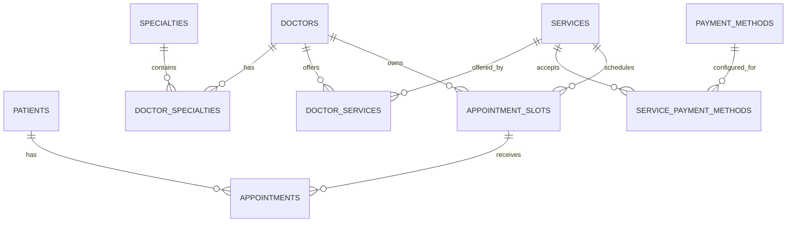

# Modelo de Dados

## 1. Princípios

- UUID v4 como identificador primário;
- `TIMESTAMPTZ` para instantes temporais;
- `NUMERIC(12,2)` para valores monetários;
- histórico preservado por transição de estado;
- integridade crítica reforçada por constraints de banco;
- disponibilidade derivada, não armazenada como booleano redundante.

## 2. Entidades principais

### `patients`

Representa pacientes conhecidos pelo sistema.

Campos relevantes:

- `id`;
- `full_name`;
- `email`;
- `phone`;
- `is_active`;
- timestamps.

Invariantes de unicidade (cadastro via `POST /v1/patients`, BR-37/BR-38):

- `uq_patients_email_lower` — `UNIQUE` sobre `lower(email)`;
- `uq_patients_phone` — `UNIQUE` sobre `phone` (`NULL` não colide);
- violações são traduzidas pela API para `409` (`/problems/patient-email-already-exists`, `/problems/patient-phone-already-exists`).

### `specialties`

Catálogo de especialidades médicas, como cardiologia e dermatologia.

### `doctors`

Cadastro de profissionais, com dados de registro e flag de atividade.

### `doctor_specialties`

Relacionamento N:N entre médicos e especialidades.

### `services`

Oferta agendável/comercial da clínica.

Campos relevantes:

- `code`;
- `name`;
- `description`;
- `price`;
- `currency`;
- `duration_minutes`;
- `is_active`.

### `doctor_services`

Relacionamento que define quais serviços cada médico está habilitado a oferecer.

### `payment_methods`

Catálogo de meios de pagamento.

### `service_payment_methods`

Configuração dos meios de pagamento aceitos por serviço, incluindo `max_installments` e observações.

### `appointment_slots`

Intervalos de agenda disponibilizados por médico/serviço.

Campos relevantes:

- `doctor_id`;
- `service_id`;
- `starts_at`;
- `ends_at`;
- `status`;
- `status_reason`.

### `appointments`

Representa a reserva/atendimento de um paciente em determinado slot.

Campos relevantes:

- `patient_id`;
- `slot_id`;
- `status`;
- `price_amount`;
- `currency`;
- dados de cancelamento/conclusão;
- timestamps.

### `idempotency_requests`

Armazena estado necessário para identificar e responder replays de comandos mutáveis.

## 3. Relações centrais



## 4. Invariantes estruturais

### Médico só agenda serviço permitido

`appointment_slots(doctor_id, service_id)` referencia a combinação existente em `doctor_services`.

Resultado: um slot inválido não pode ser criado mesmo que uma aplicação cliente tente ignorar a regra.

### Sem sobreposição de agenda do médico

É utilizada exclusion constraint GiST sobre:

- igualdade de `doctor_id`;
- sobreposição de `tstzrange(starts_at, ends_at, '[)')`.

O intervalo `[)` permite slots adjacentes, por exemplo 09:00–09:30 e 09:30–10:00.

### Sem double booking

Existe unique index parcial equivalente à regra:

```sql
UNIQUE (slot_id) WHERE status = 'scheduled'
```

Appointments históricos cancelados, concluídos ou `no_show` podem coexistir com o mesmo slot sem bloquear indevidamente uma nova reserva quando a regra de negócio permitir.

### Unicidade de contato do paciente

`uq_patients_email_lower` torna `email` único sem distinção de caixa; `uq_patients_phone` torna `phone` único (valores `NULL` não colidem). Esses índices suportam o cadastro aberto (`POST /v1/patients`) e impedem duplicatas mesmo sob concorrência; a aplicação mapeia a violação para `409` (BR-38).

## 5. Disponibilidade derivada

Um slot não recebe status `booked`. A ocupação é inferida pela existência de appointment `scheduled`.

Essa separação evita duas fontes de verdade:

```text
slot.status -> estado administrativo
appointment.status -> estado da reserva
```

## 6. Snapshot financeiro

O serviço contém o preço atual do catálogo. O appointment contém `price_amount` e `currency` copiados no momento da criação.

Consequência:

- alterar preço atual do serviço não reescreve histórico;
- auditoria permanece coerente;
- consultas antigas preservam o valor praticado na data do atendimento/agendamento.

## 7. Timezone

Os instantes são armazenados em `TIMESTAMPTZ`. Quando a regra depende de uma data civil, como `GET /availability?date=...`, a conversão considera `America/Sao_Paulo`.

## 8. Migrations e seeds

Schema e dados de demonstração são versionados separadamente com `golang-migrate`.

- migrations usam a tabela padrão de controle;
- seeds utilizam uma tabela de controle independente (`seed_migrations`).

Isso permite aplicar, reverter e inspecionar schema e dataset de demonstração de maneira previsível.
