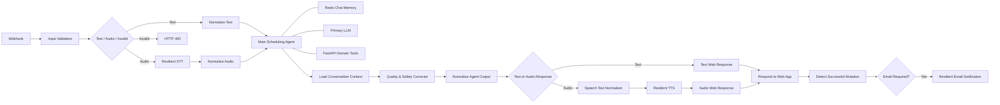
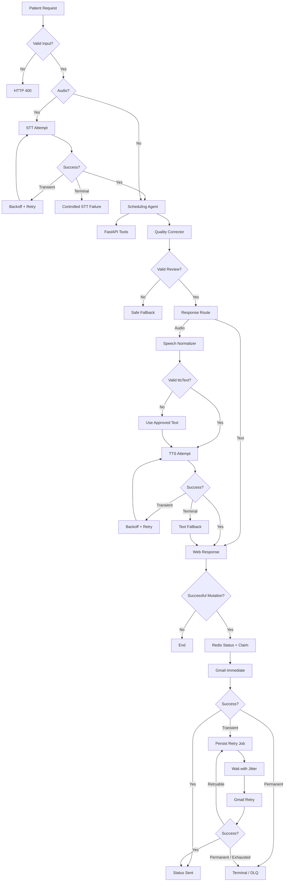

# Arquitetura do Workflow n8n — Essentia AI Medical Scheduling Assistant

> **Documento de arquitetura, funcionamento e resiliência do workflow conversacional**

---

## 1. Visão geral

O workflow do n8n é a camada de **orquestração conversacional e de integrações externas** do Essentia AI Medical Scheduling Assistant.

Sua responsabilidade é receber mensagens do cliente web, normalizar a entrada, processar texto ou áudio, manter memória conversacional, executar o agente de atendimento, acionar ferramentas determinísticas da API, revisar a resposta gerada, preparar texto para síntese de voz quando necessário, responder ao frontend e executar notificações de e-mail com mecanismos de resiliência.

O n8n **não é a fonte de verdade das regras de negócio**. Operações como disponibilidade, criação de agendamento, cancelamento, preço e consistência transacional pertencem à API FastAPI e ao PostgreSQL. O workflow atua como orquestrador.

A arquitetura segue cinco princípios principais:

1. **Separação entre comportamento probabilístico e regras determinísticas**: LLMs interpretam e produzem linguagem; a API valida e executa operações de domínio.
2. **Resiliência orientada à semântica da operação**: STT, TTS e e-mail possuem políticas de retry diferentes porque falhas nesses componentes têm impactos diferentes.
3. **Degradação graciosa**: falhas de TTS, normalização de voz ou serviços auxiliares não devem, sempre que possível, impedir o paciente de receber a resposta textual.
4. **Idempotência e deduplicação em efeitos colaterais**: mutações de domínio usam `Idempotency-Key`; notificações de e-mail usam estado e claim no Redis.
5. **Observabilidade e rastreabilidade**: chamadas à API recebem `X-Correlation-ID` baseado no execution ID do n8n.

---

## 2. Topologia de alto nível



O workflow visual está dividido em dez seções:

1. Entrada HTTP & Normalização
2. Speech-to-Text Resiliente
3. Atendente Conversacional
4. Ferramentas de Domínio / FastAPI
5. Quality & Safety Guardrail
6. Normalização & Roteamento
7. Speech Text Normalization
8. Text-to-Speech Resiliente
9. Resposta ao Frontend
10. Notificação de E-mail Resiliente

---

# 3. Seção 1 — Entrada HTTP & Normalização

## Propósito

Receber a requisição do cliente web, validar o contrato mínimo, normalizar o contexto do paciente e decidir qual caminho do workflow deve ser executado.

## Nodes principais

- `Webhook`
- `Normalize & Validate Input`
- `Route Input Type`
- `Normalize Text`
- `Build Bad Request`
- `Respond 400 - Invalid Input`

## Webhook

O endpoint configurado é:

```text
POST /webhook/essentia-ia-assistent
```

Em ambiente de desenvolvimento/teste do n8n também pode existir o equivalente em `/webhook-test/...`.

O workflow utiliza `responseMode = responseNode`, portanto a resposta HTTP é controlada explicitamente pelos nodes `Respond to Web App`, `Respond 400 - Invalid Input` e `Respond 200 - STT Failure`.

O frontend local permitido pelo CORS é:

```text
http://localhost:8080
```

## Contrato de entrada

O contexto normalizado contém:

```json
{
  "action": "sendMessage",
  "sessionId": "<session/patient UUID>",
  "patientId": "<patient UUID>",
  "patientFullName": "Maria Silva",
  "patientPhoneNumber": "...",
  "patientEmail": "maria@example.com",
  "messageType": "text | audio",
  "chatInput": "..."
}
```

Para áudio, o arquivo também é recebido como binary data do n8n.

O normalizador aceita aliases do payload legado, inclusive grafias `pacient*` / `paciente*`, e converte os dados para nomes canônicos `patient*` usados pelos nodes posteriores.

### Campos obrigatórios

Conceitualmente:

- `action`
- `sessionId`
- `patientId`
- `patientFullName`
- `patientEmail`
- `chatInput`, quando a mensagem é texto
- arquivo binário, quando a mensagem é áudio

`patientPhoneNumber` é um dado contextual e deve ser tratado como **opcional** na versão mais recente do normalizador.

> **Nota de sincronização:** o export consolidado utilizado como base deste documento ainda contém uma validação antiga que torna `pacientPhoneNumber` obrigatório. A alteração mais recente aprovada remove essa validação. Ao exportar a versão definitiva para o repositório, confirme que o node `Normalize & Validate Input` já contém a versão opcional.

## Roteamento

`Route Input Type` possui três saídas:

```text
0 -> audio
1 -> text
2 -> invalid request
```

Requisições inválidas produzem HTTP `400` com estrutura controlada, em vez de deixar o workflow falhar de maneira não tratada.

## Decisão arquitetural

Todo o contexto do paciente é normalizado **uma única vez na borda** do workflow. Nodes posteriores devem consumir `patientId`, `patientFullName`, `patientEmail` e demais valores do objeto normalizado, evitando depender do LLM para fornecer identidade do paciente.

---

# 4. Seção 2 — Speech-to-Text Resiliente

## Propósito

Converter áudio do paciente em texto em PT-BR antes de entregar a mensagem ao agente principal.

O provider atual é a API de áudio da Mistral:

```text
POST https://api.mistral.ai/v1/audio/transcriptions
```

Modelo:

```text
voxtral-mini-latest
```

Idioma:

```text
pt
```

Timeout por tentativa:

```text
30 segundos
```

## Estratégia de retry

O STT executa no máximo três tentativas.

```text
Attempt 1
   |
   | falha transitória
   v
0,75–1,00 s
   |
Attempt 2
   |
   | falha transitória
   v
2,00–2,50 s
   |
Attempt 3
```

Os delays incluem **jitter**, evitando que múltiplas execuções repitam chamadas simultaneamente após uma indisponibilidade.

## Classificação de erros

Os nodes `STT | Classify Attempt N` distinguem falhas transitórias de falhas permanentes.

São considerados candidatos a retry:

```text
HTTP 408
HTTP 425
HTTP 429
HTTP 5xx
403 associado explicitamente a rate limit/quota
timeouts
connection reset/refused
DNS ou falhas temporárias de rede
```

Erros como `400`, `401`, `403` comum, `404` e `422` não são tratados automaticamente como transitórios.

## Por que o retry é limitado

STT está no caminho síncrono da conversa. Uma transcrição gerada vários minutos depois não possui o mesmo valor para a interação atual.

Por isso a estratégia é:

```text
bounded retry -> controlled failure
```

e não:

```text
persistent queue -> delayed retry
```

## Falha terminal

Após falha não recuperável ou esgotamento das tentativas, o workflow responde de forma controlada:

```json
{
  "message": "Não consegui processar o áudio neste momento. Por favor, tente enviar o áudio novamente ou escreva sua mensagem em texto.",
  "audio": null
}
```

O áudio **não é enviado ao agente sem uma transcrição válida**.

## Decisão arquitetural

O STT é tratado como dependência síncrona de baixo tempo de utilidade. Retry curto faz sentido; retry assíncrono não.

---

# 5. Seção 3 — Atendente Conversacional

## Propósito

Interpretar a intenção do paciente, conduzir o diálogo de maneira natural e decidir quais ferramentas determinísticas devem ser utilizadas.

Node principal:

```text
Essentia Scheduling Agent
```

Modelo configurado no export atual:

```text
ministral-3b-latest
```

Configuração:

```text
temperature = 0.1
maxTokens = 256
```

## Identidade conversacional

O system prompt define explicitamente o agente como uma **atendente virtual da clínica Essentia**.

O objetivo dessa regra é evitar confusão de papéis em que o modelo:

- fala como se fosse o paciente;
- descreve a si próprio como sistema;
- responde como uma interface administrativa;
- confunde a intenção do paciente com sua própria ação.

A comunicação deve ocorrer sempre de atendente para paciente.

O agente pode utilizar Markdown quando isso ajuda na apresentação, principalmente para:

- listas curtas de horários;
- opções numeradas;
- destaques;
- pequenos blocos de informação.

Markdown é um formato de apresentação; não deve expor código, JSON, nomes de tools ou infraestrutura.

## Fonte de verdade

O LLM não decide deterministicamente:

- disponibilidade;
- preço final;
- validade de um agendamento;
- possibilidade de cancelamento;
- estado transacional.

Essas decisões pertencem às tools conectadas à API.

## Memória conversacional Redis

O agente utiliza:

```text
Redis Chat Memory
```

Chave:

```text
chat:<sessionId>
```

TTL:

```text
604800 segundos
7 dias
```

Janela:

```text
10 mensagens
```

O `sessionId` utilizado pela aplicação é associado ao próprio paciente na versão atual do projeto.

Redis oferece persistência entre execuções independentes do webhook, substituindo memória puramente local/in-process.

### Redis como memória, não como fonte de verdade de domínio

A memória serve para contexto conversacional:

- serviço já escolhido;
- preferências já informadas;
- referência a horários apresentados;
- continuidade sem repetir perguntas.

Ela não substitui PostgreSQL nem autoriza operações de domínio.

---

# 6. Seção 4 — Ferramentas de Domínio / FastAPI

## Propósito

Fornecer ao agente acesso controlado às operações autoritativas da API.

Tools existentes:

| Tool | Tipo | Responsabilidade |
|---|---|---|
| `get_patient` | leitura | consultar paciente |
| `list_services` | leitura | listar serviços |
| `get_service_details` | leitura | detalhes/preço/duração |
| `get_payment_methods` | leitura | meios de pagamento |
| `get_available_slots` | leitura | disponibilidade |
| `get_appointment` | leitura | consultar agendamento |
| `book_appointment` | mutação | criar agendamento |
| `cancel_appointment` | mutação | cancelar agendamento |

## Identidade do paciente

`get_patient` usa o `patientId` normalizado no início do workflow.

Nas mutações, a identidade do paciente também é enviada pelo header:

```http
X-Patient-Id: <patientId>
```

Isso reduz dependência do modelo para determinar identidade.

## Correlation ID

As chamadas à API incluem:

```http
X-Correlation-ID: <n8n execution id>
```

Isso permite correlacionar:

```text
requisição web
-> execução n8n
-> chamada FastAPI
-> logs da API
```

## Idempotência das mutações

`book_appointment`:

```http
Idempotency-Key: <executionId>-book
```

`cancel_appointment`:

```http
Idempotency-Key: <executionId>-cancel
```

A finalidade é proteger o sistema contra repetição acidental da mesma mutação durante uma única execução/orquestração.

A idempotência real é aplicada e validada pela API.

## Agendamento

O agente deve:

```text
identificar serviço
-> consultar disponibilidade
-> paciente escolher slot
-> book_appointment
```

O `slot_id` precisa vir de `get_available_slots`.

O `patient_id` vem diretamente do contexto normalizado do webhook.

## Cancelamento

O agente deve identificar o agendamento, consultar seus detalhes quando necessário, obter o motivo de cancelamento e somente então utilizar `cancel_appointment`.

## PostgreSQL como source of truth

Mesmo que disponibilidade seja cacheada em Redis na API, a mutação deve validar o estado real transacionalmente no PostgreSQL.

Isso impede que cache, memória do agente ou informação antiga autorize uma reserva inválida.

## Observação sobre Human Review

O system prompt e as descrições das tools contêm referências a Human Review para `book_appointment` e `cancel_appointment`.

Entretanto, **o workflow consolidado analisado não contém atualmente um node/topologia de Human Review que intercepte essas duas tools**.

Portanto, a documentação técnica não deve afirmar que Human Review está implementado até que exista um mecanismo efetivo no grafo.

Existem duas opções antes da entrega final:

```text
A) implementar Human Review real
```

ou:

```text
B) remover do prompt/tool descriptions as afirmações de que essa camada existe
```

O case oficial não exige Human Review; trata-se de uma melhoria adicional.

---

# 7. Seção 5 — Quality & Safety Guardrail

## Propósito

Revisar a **última resposta produzida pelo agente principal** antes que ela seja entregue ao paciente.

O corretor avalia:

- coerência com o histórico;
- aderência à intenção atual;
- papel correto de atendente;
- português brasileiro;
- gramática e coesão;
- clareza;
- segurança clínica;
- segurança operacional;
- privacidade;
- exposição de implementação interna;
- comunicação abusiva/discriminatória;
- afirmações de mutação sem evidência.

## Contexto compartilhado sem contaminação de memória

Antes do corretor existe:

```text
Load Conversation Context
```

Esse node usa a mesma `Conversation Memory` Redis em **modo de leitura**.

A arquitetura é:

```text
Main Agent
   |
   v
Redis memory is read
   |
   v
Quality Corrector
```

O corretor recebe contexto suficiente para entender referências como:

```text
"esse horário"
"ela"
"o serviço anterior"
"quero aquele"
```

Mas ele **não recebe a memória como memória própria de escrita**.

Isso evita que mensagens internas de avaliação sejam gravadas na conversa do paciente.

## Escopo explícito

O prompt determina que:

```text
conversationContext -> contexto para avaliação
patientMessage      -> mensagem atual
assistantDraft      -> única resposta que pode ser corrigida
```

O corretor não deve reescrever turnos anteriores.

## Saída estruturada

O `Structured Output Parser` exige uma decisão:

```json
{
  "decision": "pass | correct | block",
  "severity": "none | low | medium | high",
  "issues": [],
  "finalText": "...",
  "flags": {
    "languageError": false,
    "roleConfusion": false,
    "unsafeMedicalAdvice": false,
    "abusiveCommunication": false,
    "privacyOrInternalLeak": false,
    "unsupportedMutationSuccess": false,
    "hallucinatedOperationalData": false,
    "offTopicOrUnhelpful": false,
    "contextInconsistency": false
  }
}
```

## Estratégia anti-drift

Quando:

```text
decision = pass
```

`Apply Review Decision` preserva literalmente o texto do agente principal.

Isso evita que um segundo LLM reformule continuamente respostas corretas apenas por preferência estilística.

Quando:

```text
decision = correct
```

é utilizada a correção mínima.

Quando:

```text
decision = block
```

é retornada uma resposta segura sem inventar informação.

## Evidência de mutação

O corretor inspeciona os `intermediateSteps` do agente e tenta reconhecer resultados conclusivos de:

```text
book_appointment
cancel_appointment
```

Uma frase como:

```text
"Seu agendamento foi realizado com sucesso."
```

somente é permitida quando houver evidência correspondente na tool.

Isso cria uma segunda barreira contra uma afirmação textual de sucesso não sustentada pelo resultado da API.

## Falha do próprio corretor

O node utiliza:

```text
onError = continueErrorOutput
```

Em falha, segue para:

```text
Corrector Safe Fallback
```

que produz uma mensagem segura em vez de deixar passar silenciosamente uma resposta não revisada.

### Trade-off

Esse comportamento é **fail-closed para qualidade**: uma indisponibilidade do corretor pode impedir a resposta original de seguir normalmente.

Isso privilegia segurança sobre disponibilidade.

## Modelo atual

```text
mistral-small-latest
temperature = 0.1
maxTokens = 900
```

## Limitação operacional atual: rate limit

O corretor envia histórico recente + mensagem atual + resposta candidata. Isso pode consumir tokens relevantes.

Além disso, uma única interação por áudio pode utilizar a Mistral em várias etapas:

```text
STT
-> Main Agent
-> Quality Corrector
-> Speech Normalizer
-> TTS
```

Isso aumenta a chance de HTTP `429`.

### Model fallback

Foi definida como evolução recomendada a estratégia:

```text
Mistral primary
-> provider-diverse fallback
```

por exemplo OpenRouter/Gemini/Groq.

**O export atual ainda não contém fallback de LLM configurado nos agentes.**

A documentação não deve declarar cross-provider model fallback como funcional até que os nodes tenham `Fallback Model` efetivamente conectados.

---

# 8. Seção 6 — Normalização & Roteamento da Resposta

## Propósito

Converter a saída aprovada pelo Quality Corrector em um contrato simples e determinar se a resposta final deve incluir áudio.

Node:

```text
Normalize Agent Output
```

Contrato:

```json
{
  "message": "texto final aprovado",
  "messageType": "text | audio"
}
```

`Route Response Type` decide:

```text
audio -> Speech Text Normalization
text  -> Build Text Web Response
```

A escolha do formato da resposta acompanha o tipo da mensagem de entrada.

## Decisão arquitetural

O texto aprovado é mantido como representação visual canônica.

A transformação necessária para voz ocorre **em outra propriedade**, sem destruir o texto original.

---

# 9. Seção 7 — Speech Text Normalization

## Propósito

Criar uma versão do texto adequada para síntese de voz.

Essa camada existe porque um texto visualmente bom não é necessariamente um texto ideal para TTS.

Exemplo:

```markdown
Sua consulta está marcada para **24/09 às 14:30**.

Valor: R$ 320,00.
```

Representação de voz:

```text
Sua consulta está marcada para vinte e quatro de setembro,
às quatorze horas e trinta minutos.
O valor é trezentos e vinte reais.
```

## Separação de representações

O workflow mantém:

```text
message -> texto visual aprovado
ttsText -> representação exclusiva para fala
```

Isso evita sacrificar a apresentação Markdown do frontend para facilitar o TTS.

## Transformações

O normalizador pode:

- remover Markdown;
- converter listas em prosa;
- escrever números por extenso;
- normalizar moedas;
- normalizar porcentagens;
- converter datas;
- converter horários;
- expandir abreviações;
- tornar símbolos pronunciáveis;
- transformar telefone/protocolos em leitura dígito a dígito quando aplicável.

## Saída estruturada

```json
{
  "ttsText": "...",
  "changed": true,
  "transformations": [
    "markdown_removed",
    "numbers_expanded",
    "currency_normalized",
    "date_normalized",
    "time_normalized"
  ]
}
```

## Validação determinística posterior

`Apply Speech Normalization` não confia somente na resposta do LLM.

Ele verifica programaticamente se ainda existem:

```text
algarismos arábicos
Markdown reconhecível
```

Se a transformação for inválida, o node falha e aciona o caminho de fallback.

## Retry do agente normalizador

O agente possui:

```text
retryOnFail = true
maxTries = 2
waitBetweenTries = 750 ms
```

Modelo atual:

```text
mistral-small-latest
temperature = 0
maxTokens = 1200
```

A temperatura zero reduz variação em uma tarefa de transformação que deve ser conservadora.

## Degradação graciosa

Se o normalizador falhar:

```text
Speech Normalization Fallback
```

usa:

```text
ttsText = message
```

O áudio ainda pode ser gerado usando o texto já aprovado.

Portanto:

```text
speech normalization failure != conversation failure
```

O preço da degradação é possível piora de pronúncia, não perda da resposta.

---

# 10. Seção 8 — Text-to-Speech Resiliente

## Propósito

Gerar resposta em áudio quando a mensagem original do paciente foi enviada por áudio.

## Descoberta de voz

O workflow consulta:

```text
GET https://api.mistral.ai/v1/audio/voices
```

e procura uma voz preset compatível com:

```text
pt
pt-BR
pt-*
```

Se nenhuma voz em português for encontrada, usa a primeira disponível.

`List Mistral Preset Voices` possui:

```text
maxTries = 3
waitBetweenTries = 1000 ms
```

Falha na descoberta de voz degrada diretamente para resposta textual.

## Síntese

Endpoint:

```text
POST https://api.mistral.ai/v1/audio/speech
```

Modelo:

```text
voxtral-mini-tts-2603
```

Formato:

```text
mp3
```

O input é:

```text
Finalize TTS Input.ttsText
```

e não o Markdown visual original.

## Retry

O TTS possui até três tentativas.

```text
Attempt 1
   |
0,50–0,75 s
   |
Attempt 2
   |
1,50–2,00 s
   |
Attempt 3
```

A classificação de falhas segue a mesma lógica geral do STT:

```text
408 / 425 / 429 / 5xx
rate limit
timeout
network errors
```

podem ser retryable.

## Degradação graciosa

Se a síntese falhar:

```text
TTS | Text Fallback
```

produz:

```json
{
  "message": "<texto aprovado>",
  "audio": null,
  "ttsDegraded": true
}
```

A indisponibilidade do provider de voz não impede a entrega da resposta textual.

## Por que não existe retry assíncrono de TTS

Áudio conversacional possui baixo valor temporal.

Gerar o áudio vários minutos depois não atende adequadamente à interação original.

A estratégia é:

```text
bounded retry -> textual degradation
```

---

# 11. Seção 9 — Resposta ao Frontend

## Propósito

Encerrar a parte síncrona da experiência do paciente.

Resposta textual:

```json
{
  "message": "...",
  "audio": null
}
```

Resposta com voz:

```json
{
  "message": "...",
  "audio": {
    "mimeType": "audio/mpeg",
    "base64": "..."
  }
}
```

Node:

```text
Respond to Web App
```

HTTP:

```text
200 OK
Content-Type: application/json
Access-Control-Allow-Origin: http://localhost:8080
```

## Decisão arquitetural importante

A resposta HTTP acontece **antes da camada de notificação por e-mail**.

Isso desacopla a latência do paciente da latência do Gmail/retries.

Fluxo conceitual:

```text
domain mutation
-> agent response
-> frontend receives response
-> email side effect continues
```

O usuário não precisa aguardar toda a política de retry do e-mail para receber a resposta do chat.

---

# 12. Seção 10 — Notificação de E-mail Resiliente

## Propósito

Enviar e-mail somente após uma mutação de agendamento ou cancelamento realmente confirmada, evitando duplicidade e tolerando indisponibilidade temporária do Gmail.

## Disparo baseado em evidência

`Detect Successful Mutation` analisa `intermediateSteps` do agente.

Somente cria evento quando encontra resultado conclusivo de:

```text
book_appointment
```

ou:

```text
cancel_appointment
```

O fluxo não dispara confirmação de e-mail apenas porque o texto do LLM diz que a operação ocorreu.

Eventos:

```text
appointment_booked
appointment_cancelled
```

## Identificador lógico

```text
<eventType>:<appointmentId>
```

Exemplo:

```text
appointment_booked:550e8400-e29b-41d4-a716-446655440000
```

Isso permite tratar separadamente o e-mail de criação e o e-mail de cancelamento do mesmo agendamento.

## Namespaces Redis

Status:

```text
notification:email:<eventType>:<appointmentId>
```

Claim:

```text
notification:email:claim:<eventType>:<appointmentId>
```

Retry job:

```text
retry:email:job:<eventType>:<appointmentId>
```

Dead Letter Queue:

```text
retry:email:dead-letter
```

## TTLs

Status:

```text
30 dias
2592000 segundos
```

Claim:

```text
10 minutos
600 segundos
```

Retry job ativo:

```text
7 dias
604800 segundos
```

Estado terminal persistido:

```text
30 dias
```

## Deduplicação em duas camadas

### 1. Verificação de status

Estados que bloqueiam novo envio:

```text
sending
sent
retry_scheduled
retrying
failed_permanent
dead_letter
```

Se já existir estado bloqueante:

```text
Result - Deduplicated
```

é produzido e o Gmail não é chamado novamente.

### 2. Claim com Redis INCR

O node:

```text
Acquire Dedup Claim
```

usa incremento atômico.

Somente:

```text
claimCount == 1
```

é considerado proprietário do envio.

O claim possui TTL para evitar bloqueio permanente.

## Envio imediato

`Send Email - Immediate` usa o Gmail node com:

```text
retryOnFail = true
maxTries = 3
waitBetweenTries = 5000 ms
```

Portanto, pequenas falhas transitórias podem ser resolvidas sem entrar no mecanismo assíncrono.

## Classificação de falha do Gmail

Retryable:

```text
408
425
429
5xx
403 associado a rate/quota
timeouts
network errors
erros sem status claramente permanente
```

Permanent:

```text
requisições inválidas
falhas de autenticação/autorização não relacionadas a quota
demais erros classificados como não transitórios
```

## Retry assíncrono persistido

Após falha transitória do envio imediato, é criado um retry job.

Backoff aproximado:

```text
attempt 1 -> 60 segundos
attempt 2 -> 5 minutos
attempt 3 -> 15 minutos
attempt 4 -> 60 minutos
```

Cada delay recebe jitter de aproximadamente ±10%.

O `Wait Retry Delay` mantém a execução agendada pelo n8n, enquanto o estado é persistido no Redis.

Essa combinação evita depender apenas de um `POP` destrutivo de fila e mantém estado observável da tentativa.

## Retry interno de cada tentativa assíncrona

`Send Email - Retry` possui:

```text
retryOnFail = true
maxTries = 2
waitBetweenTries = 5000 ms
```

Assim, cada rodada assíncrona também tolera uma pequena falha transitória local.

## Dead Letter Queue

Quando:

```text
erro permanente
```

ou:

```text
maxAsyncAttempts esgotado
```

o evento é transformado em dead letter e enviado para:

```text
retry:email:dead-letter
```

Estados terminais:

```text
failed_permanent
dead_letter
```

A DLQ permite investigação posterior sem loop infinito de retry.

## Estado de sucesso

Em envio concluído:

```text
status = sent
```

São persistidos, quando disponíveis:

```text
Gmail message ID
Gmail thread ID
sentAt
recipient
appointmentId
eventType
```

O retry job é removido.

## Falha do Redis na camada de e-mail

Os principais nodes Redis da notificação usam:

```text
onError = continueErrorOutput
```

e o grafo encaminha vários desses error outputs para o próximo estágio.

Isso implementa uma forma de **degradação da coordenação**: a indisponibilidade do Redis não deve necessariamente impedir o Gmail de ser tentado.

Entretanto, nesse cenário:

```text
dedup reliability ↓
status observability ↓
retry durability ↓
```

Portanto, não se trata de garantia exactly-once.

## Semântica de entrega

A arquitetura deve ser descrita como:

```text
at-least-once delivery
+
application-level best-effort deduplication
```

e não como exactly-once.

Existe uma janela inevitável em integrações externas:

```text
Gmail aceita a mensagem
-> conexão falha antes da confirmação
-> retry pode reenviar
```

Nenhuma deduplicação local elimina completamente essa ambiguidade sem suporte idempotente do provider externo.

---

# 13. Estratégias de resiliência consolidadas

| Componente | Estratégia | Falha terminal |
|---|---|---|
| Input | validação determinística | HTTP 400 |
| STT | 3 tentativas + backoff + jitter | resposta controlada solicitando novo áudio/texto |
| Main Agent | memória Redis + tools autoritativas | atualmente sem cross-provider fallback |
| Quality Corrector | structured output + safe fallback | mensagem segura |
| Speech Normalizer | 2 tentativas + validação determinística | usa texto original aprovado |
| Voice lookup | retries rápidos | texto sem áudio |
| TTS | 3 tentativas + backoff + jitter | texto sem áudio |
| API mutations | `Idempotency-Key` + PostgreSQL/API | erro da operação; não inventar sucesso |
| Email | retry imediato + retry assíncrono persistido + jitter | DLQ |
| Email dedup | status + Redis claim | best-effort degradation se Redis indisponível |
| Conversation memory | Redis + TTL | perda de contexto se Redis indisponível |
| Observability | `X-Correlation-ID` | correlação entre n8n/API |

---

# 14. Por que cada integração possui uma política diferente

A resiliência não deve ser uniforme apenas por conveniência técnica.

## STT

Valor temporal alto e imediato.

```text
retry curto -> falha controlada
```

## TTS

Áudio é desejável, mas texto já possui valor completo.

```text
retry curto -> graceful degradation para texto
```

## Speech Normalization

É otimização de renderização, não dado de negócio.

```text
retry curto -> usar texto original
```

## Quality Corrector

É uma barreira de segurança.

```text
failure -> safe fallback
```

A política atual privilegia safety.

## E-mail

A confirmação continua útil minutos depois.

```text
retry rápido
-> retry assíncrono
-> persistência
-> DLQ
```

Essa diferença de tratamento demonstra que retry é aplicado com base na **semântica e no valor temporal do efeito**, e não como configuração genérica.

---

# 15. Redis no workflow

Redis atualmente possui três papéis conceituais no ecossistema.

## Memória conversacional

```text
chat:*
```

## Estado/deduplicação de notificação

```text
notification:email:*
```

## Retry/DLQ

```text
retry:email:*
retry:email:dead-letter
```

Na arquitetura definida para o projeto, os dados de workflow do n8n devem utilizar Redis DB separado do cache da API.

Exemplo:

```text
DB 0 -> FastAPI / availability cache
DB 1 -> n8n / memory + notification state + retries
```

Essa separação é apenas lógica. Ela não fornece isolamento de CPU, memória ou disponibilidade como instâncias Redis distintas forneceriam.

---

# 16. Segurança e boundaries

## O LLM não é autoridade transacional

A resposta do modelo não pode ser usada como confirmação de:

- agendamento;
- cancelamento;
- disponibilidade;
- preço;
- pagamento.

## IDs autoritativos

Identidade do paciente vem do webhook normalizado.

IDs de serviço, slot e appointment devem vir de contexto autoritativo ou tools.

## Segurança clínica

O prompt proíbe:

- diagnóstico;
- prescrição;
- interpretação clínica;
- medicamentos;
- tratamento.

O Quality Corrector adiciona uma segunda camada de inspeção.

## Proteção contra prompt injection no guardrail

O corretor e o normalizador de voz tratam:

```text
patientMessage
assistantDraft
conversationContext
sourceText
```

como **dados não confiáveis**, não como instruções de sistema.

---

# 17. Observabilidade

## Correlation ID

Todas as ferramentas HTTP da API utilizam:

```http
X-Correlation-ID: {{ $execution.id }}
```

Isso deve ser incluído nos logs da API.

## Estados úteis para investigação

E-mail:

```text
sending
retry_scheduled
retrying
sent
failed_permanent
dead_letter
```

Speech normalization:

```text
speechNormalization.degraded
```

TTS:

```text
ttsDegraded
```

STT:

```text
sttFailure.attempts
sttFailure.retryable
sttFailure.statusCode
```

Quality review:

```text
qualityReview.decision
qualityReview.severity
qualityReview.issues
qualityReview.flags
```

Esses campos permitem distinguir falha de domínio de degradação de experiência.

---

# 18. Pontos de atenção antes da entrega

## 18.1. Atualizar export com telefone opcional

A última decisão foi tornar:

```text
patientPhoneNumber
```

opcional.

Confirme que o export definitivo do workflow não contém:

```javascript
if (!patientPhoneNumber) {
  validationErrors.push(...);
}
```

## 18.2. Human Review

O prompt menciona Human Review, mas o grafo analisado não contém essa implementação.

Antes de entregar:

```text
implementar a camada
```

ou remover referências que fariam o workflow parecer ter uma garantia que não possui.

## 18.3. LLM fallback

A arquitetura discutida recomenda provider-diverse fallback devido aos `429` observados na Mistral.

Exemplo:

```text
Main Agent:
Mistral -> OpenRouter/Gemini

Quality Corrector:
OpenRouter/Gemini -> Mistral

Speech Normalizer:
OpenRouter/Gemini -> Mistral
```

No entanto, **isso ainda não faz parte do export final analisado**.

Não documentar como funcional até configurar `Enable Fallback Model` e conectar efetivamente os modelos de fallback.

## 18.4. Concentração de chamadas Mistral

Uma interação por áudio pode gerar várias chamadas ao mesmo provider:

```text
STT
Main Agent
Quality Corrector
Speech Normalizer
TTS
```

No free tier, isso aumenta risco de rate limiting.

Distribuir agentes auxiliares entre providers é uma melhoria operacional relevante.

---

# 19. Checklist de testes do workflow

## Entrada

- texto válido retorna HTTP 200;
- áudio válido segue para STT;
- payload inválido retorna HTTP 400;
- telefone ausente continua válido na versão atualizada;
- `patientId` é preservado e utilizado nas mutações.

## STT

- transcrição válida no primeiro attempt;
- retry após erro 429/5xx;
- retry após timeout;
- erro 400 não entra em loop;
- terceiro erro retorna falha controlada.

## Agente

- mantém papel de atendente;
- utiliza memória entre turnos;
- não repete perguntas já respondidas;
- consulta tools para dados autoritativos;
- não inventa IDs;
- não declara mutação sem retorno da API.

## Quality Corrector

- `pass` preserva texto original;
- erro gramatical gera `correct`;
- confusão de papel gera correção;
- orientação clínica indevida é bloqueada/corrigida;
- sucesso de mutação sem evidência é removido;
- falha do corretor entra em safe fallback.

## Speech Normalizer

- Markdown é removido do `ttsText`;
- `message` visual permanece inalterado;
- números são escritos por extenso;
- datas e horários são convertidos;
- moeda é pronunciável;
- saída com dígitos residuais é rejeitada;
- falha usa texto original.

## TTS

- voz pt-BR é preferida;
- áudio MP3 válido é retornado;
- 429/5xx entra em retry;
- falha final preserva resposta textual.

## Email

- booking confirmado envia e-mail;
- cancellation confirmado envia e-mail;
- sem mutação não envia;
- segundo processamento do mesmo evento é deduplicado;
- Gmail transient error cria retry;
- permanent error vai para estado terminal;
- retries esgotados vão para DLQ;
- sucesso remove retry job;
- frontend recebe resposta antes de retries longos de e-mail.

---

# 20. Resumo arquitetural

O workflow foi projetado para manter o LLM na função em que ele agrega valor — **compreensão e geração de linguagem** — enquanto regras de negócio e mutações permanecem em componentes determinísticos.

A cadeia principal é:

```text
input
-> modality handling
-> conversational agent
-> deterministic domain tools
-> quality/safety review
-> response routing
-> optional speech normalization
-> optional TTS
-> web response
-> asynchronous notification side effects
```

As principais propriedades de engenharia são:

```text
PostgreSQL/API as domain source of truth
Redis-backed conversational memory
mutation idempotency
correlation IDs
bounded STT/TTS retries
error classification
exponential-style backoff with jitter
graceful degradation
structured LLM guardrails
deterministic post-validation
email deduplication
persistent retry state
dead-letter handling
separation of synchronous UX from delayed side effects
```

O resultado é um workflow que não trata todos os erros da mesma forma: cada integração possui uma política baseada em criticidade, reversibilidade, valor temporal e possibilidade de degradação.

---

# 21. Diagrama de resiliência


