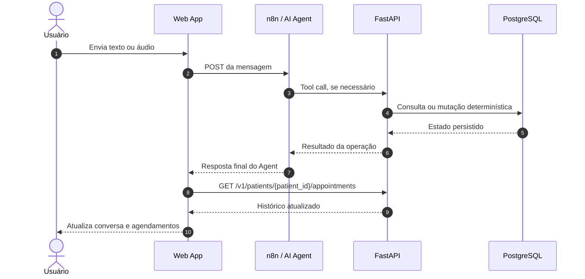
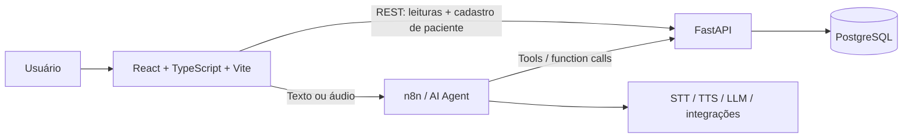
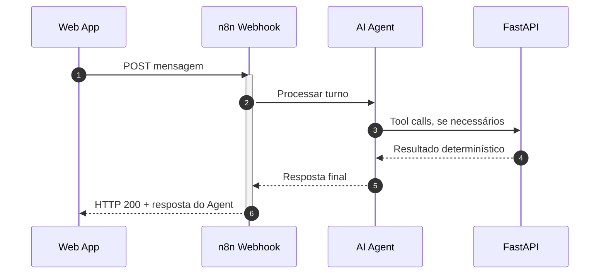
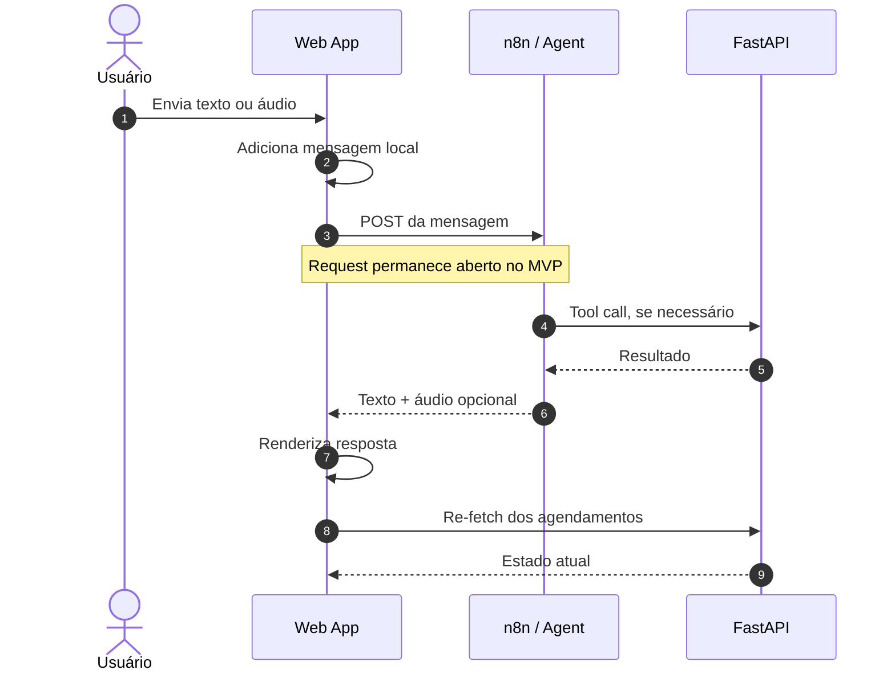
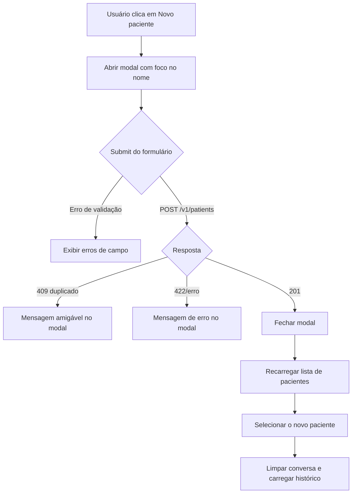
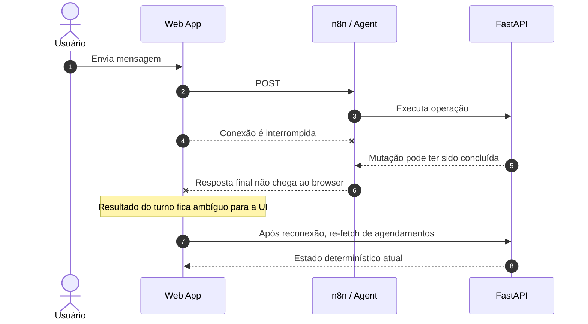
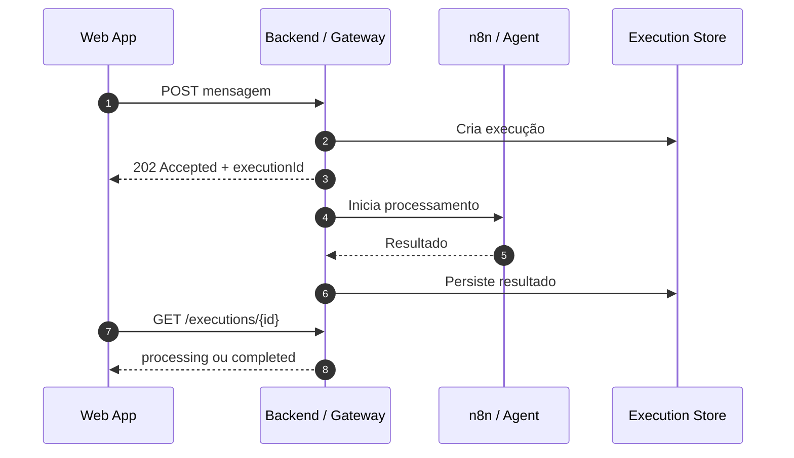

# Especificação da Aplicação Web

## 1. Objetivo

Construir uma aplicação web para demonstrar a experiência conversacional do **Essentia AI Medical Scheduling Assistant**, integrando:

- **n8n / AI Agent** para interação conversacional por texto e áudio;
- **FastAPI** para consultas determinísticas e para o cadastro de pacientes;
- **PostgreSQL**, acessado exclusivamente pela API, como fonte de verdade transacional.

A aplicação web é uma camada de apresentação e interação. Ela não implementa regras de agendamento, não decide disponibilidade e não executa mutações de agendamento diretamente; o único comando de escrita originado na UI é o cadastro de paciente (`POST /v1/patients`), executado e validado pela FastAPI.

Princípio mantido:

> O modelo de IA interpreta intenção e linguagem natural; o n8n orquestra integrações e o fluxo conversacional; a FastAPI governa regras determinísticas; o PostgreSQL garante as invariantes finais de consistência.

---

## 2. Escopo funcional

### WEB-RF-01 — Selecionar e cadastrar paciente

A aplicação deve carregar os pacientes cadastrados, permitir selecionar o paciente representado na conversa e cadastrar novos pacientes.

Para o ambiente demonstrativo:

- o seletor deve exibir pelo menos nome e e-mail;
- pacientes inativos podem ser exibidos, desde que seu estado seja identificado visualmente;
- o primeiro paciente ativo pode ser selecionado automaticamente;
- se não houver pacientes, chat e histórico de agendamentos devem permanecer indisponíveis, mas o botão **Novo paciente** continua habilitado para permitir o primeiro cadastro;
- o modal deve ter fundo em blur (scrim), fechar por Escape/clique no backdrop, não pode abrir outro modal dentro dele, e deve exibir mensagens amigáveis para conflitos de e-mail/telefone (`409`);
- após cadastro bem-sucedido, a lista é recarregada e o novo paciente é selecionado automaticamente.

A seleção manual do paciente representa apenas uma identidade de demonstração e não substitui autenticação ou autorização.

Dependências da API:

```http
GET /v1/patients
POST /v1/patients
```

Contrato de listagem (canônico usa `full_name`, mesmo de `GET /v1/patients/{patient_id}`):

```json
[
  {
    "id": "uuid",
    "full_name": "Maria Silva",
    "email": "maria@example.com",
    "is_active": true
  }
]
```

O frontend mapeia `full_name` para o campo de apresentação `name` em `api.service.ts`.

### WEB-RF-02 — Identificar a sessão conversacional pelo paciente

Nesta versão da aplicação, o UUID persistente do próprio paciente deve ser utilizado como identificador da sessão conversacional no n8n/Agent.

Portanto:

- não deve ser gerado um `sessionId` independente no frontend;
- o valor utilizado como chave de sessão deve ser o `id` do paciente selecionado;
- todos os turnos de um mesmo paciente reutilizam essa mesma chave;
- ao trocar de paciente, a chave de sessão muda automaticamente porque passa a ser utilizado o UUID do novo paciente;
- cada paciente possui, nesta versão, uma única memória conversacional contínua.

Ao trocar de paciente, a aplicação deve:

1. invalidar ou ignorar requests ainda associados ao paciente anterior;
2. limpar a conversa visível;
3. utilizar o UUID do novo paciente como chave da sessão conversacional;
4. carregar o histórico de agendamentos do novo paciente.

Essa decisão simplifica o MVP. Caso futuramente seja necessário manter múltiplas conversas independentes para um mesmo paciente, deverá ser introduzida uma entidade de sessão/conversa própria.

### WEB-RF-03 — Enviar mensagem de texto

O usuário deve poder enviar mensagens de texto ao endpoint conversacional do n8n.

Cada requisição deve fornecer semanticamente:

- UUID do paciente selecionado (`patientId`), utilizado também como chave da sessão conversacional (`sessionId`);
- nome completo, e-mail e telefone do paciente selecionado;
- texto digitado pelo usuário.

Contrato conceitual:

```json
{
  "action": "sendMessage",
  "sessionId": "uuid-do-paciente",
  "patientId": "uuid-do-paciente",
  "patientName": "Maria Silva",
  "patientEmail": "maria@example.com",
  "patientPhone": "+5548999990001",
  "chatInput": "Gostaria de agendar uma consulta de cardiologia."
}
```

Enquanto o workflow n8n utilizar o campo `sessionId`, o frontend preenche esse campo com `selectedPatient.id`; `patientId` é enviado em paralelo com o mesmo valor para que o contrato do workflow possa migrar para o campo dedicado sem alteração no frontend. Os demais campos carregam os dados cadastrais do paciente selecionado para uso do Agent.

Os nomes finais dos campos devem seguir o contrato efetivamente exposto pelo workflow n8n.

Enquanto um turno estiver em processamento, a interface deve impedir submissões duplicadas do mesmo input.

### WEB-RF-04 — Enviar mensagem de áudio

O usuário deve poder gravar uma mensagem utilizando o microfone do navegador.

A interação deve suportar:

- iniciar gravação;
- indicar visualmente que a gravação está ativa;
- interromper gravação;
- cancelar gravação;
- enviar o áudio gravado.

O navegador deve enviar o áudio ao n8n sem realizar speech-to-text localmente.

O transporte recomendado é `multipart/form-data`, contendo semanticamente:

```text
action = sendMessage
sessionId = selectedPatient.id
patientId = selectedPatient.id
patientName
patientEmail
patientPhone
messageType = audio
audio file
```

O formato de áudio deve ser detectado em runtime conforme suporte do navegador, sem assumir um único codec.

### WEB-RF-05 — Exibir respostas do assistente

Cada resposta concluída do Agent deve ser exibida no histórico da conversa.

A resposta textual é a representação canônica do turno do assistente.

Quando o workflow retornar áudio gerado por TTS, a interface também deve permitir sua reprodução.

Contrato conceitual de resposta:

```json
{
  "message": "Seu agendamento foi realizado.",
  "audio": {
    "mimeType": "audio/mpeg",
    "base64": "<audio-codificado>"
  }
}
```

O campo `audio` pode ser ausente ou `null`.

Se o workflow utilizar outro formato de transporte, deve preservar a mesma semântica: texto obrigatório e áudio opcional associados ao mesmo turno.

### WEB-RF-06 — Consultar histórico de agendamentos

A aplicação deve carregar o histórico de agendamentos do paciente selecionado diretamente pela FastAPI.

O histórico não deve ser obtido por meio do AI Agent.

Dependência da API:

```http
GET /v1/patients/{patient_id}/appointments
```

O retorno deve incluir os estados atualmente reconhecidos pelo domínio:

```text
scheduled
cancelled
completed
no_show
```

A interface deve exibir pelo menos:

- data e horário;
- serviço;
- médico;
- status.

Também podem ser exibidos:

- horário final;
- preço e moeda;
- motivo de cancelamento.

A tabela é somente leitura. O frontend não deve permitir editar status ou executar criação/cancelamento diretamente por controles da tabela.

### WEB-RF-07 — Sincronizar histórico após a conversa

Após cada turno do assistente concluído com sucesso, o frontend deve consultar novamente o histórico do paciente selecionado.



Essa sincronização deve ocorrer independentemente de o frontend saber se o turno provocou criação, cancelamento ou nenhuma mutação.

A estratégia evita que a interface interprete texto do LLM ou dependa de um campo de intenção para decidir se houve alteração de domínio. O custo aceito é uma requisição de leitura adicional após cada turno concluído.

A mesma consulta deve ocorrer:

- após a seleção inicial de um paciente;
- após troca de paciente;
- quando o usuário solicitar retry após falha de sincronização;
- após recuperação de conectividade, quando houver dúvida sobre o estado de uma operação anterior.

Se a atualização falhar, os dados já carregados devem permanecer visíveis e a interface deve indicar que o histórico pode estar desatualizado.

O frontend não deve reenviar automaticamente a mensagem conversacional para tentar reconstruir uma mutação cujo resultado seja desconhecido.

### WEB-RF-08 — Isolar estado entre pacientes

Conversa, chave de sessão conversacional, metadados do paciente e histórico de agendamentos devem sempre pertencer ao mesmo paciente selecionado.

A chave de sessão conversacional é o próprio UUID do paciente (`selectedPatient.id`).

Se o paciente for alterado enquanto houver requests em andamento:

- as requisições anteriores devem ser canceladas quando possível; ou
- suas respostas devem ser ignoradas quando chegarem fora de contexto.

Uma resposta pertencente ao paciente anterior nunca deve sobrescrever o estado do paciente atualmente selecionado.

---

## 3. Requisitos não funcionais

### WEB-RNF-01 — Boundary determinístico

O frontend não deve implementar regras transacionais de agenda.

Ele não decide:

- disponibilidade de slot;
- elegibilidade do paciente para agendamento;
- preço final;
- possibilidade de cancelamento;
- transições válidas de status.

Essas decisões permanecem na FastAPI e no PostgreSQL.

### WEB-RNF-02 — Segurança

A aplicação web não deve:

- acessar PostgreSQL diretamente;
- acessar o provedor de LLM diretamente;
- armazenar credenciais do n8n, banco, e-mail, STT, TTS ou LLM no bundle;
- tratar o e-mail enviado ao workflow como autenticação real.

Somente configurações públicas necessárias ao browser podem ser expostas, como URLs públicas da API e do endpoint conversacional.

### WEB-RNF-03 — Estados assíncronos explícitos

A interface deve representar de forma compreensível pelo menos:

- carregamento de pacientes;
- carregamento do histórico;
- envio de mensagem;
- espera pela resposta do assistente;
- gravação de áudio;
- erro de conversa;
- erro de sincronização do histórico.

Falhas de leitura não devem provocar replay automático de operações conversacionais mutáveis.

### WEB-RNF-04 — Compatibilidade de áudio

A implementação deve utilizar APIs nativas do navegador quando disponíveis e detectar suporte a gravação e MIME types em runtime.

Se o navegador não suportar gravação ou a permissão do microfone for negada:

- o chat textual deve continuar funcional;
- a interface deve informar a indisponibilidade do recurso de áudio;
- as demais funcionalidades não devem falhar.

### WEB-RNF-05 — Responsividade

O alvo principal é desktop, com conversa e histórico de agendamentos visíveis simultaneamente.

Em telas menores, as regiões podem ser reorganizadas verticalmente, desde que todas as funcionalidades permaneçam acessíveis.

### WEB-RNF-06 — Acessibilidade

Os controles interativos devem possuir labels acessíveis e navegação por teclado.

No mínimo:

- seletor de paciente;
- botão Novo paciente e controles do modal de cadastro (formulário, fechar, cancelar, enviar);
- input de mensagem;
- botão de envio;
- controles de gravação;
- reprodução de áudio;
- retry do histórico.

Estados e status não devem depender exclusivamente de cor.

### WEB-RNF-07 — Representação temporal

Datas e horários devem ser recebidos da API como valores timezone-aware.

A apresentação pode utilizar a timezone de negócio já definida pelo sistema (`America/Sao_Paulo`), sem transformar timestamps ingênuos em informação autoritativa de agenda.

### WEB-RNF-08 — Build reprodutível

A aplicação deve:

- utilizar React + TypeScript + Vite;
- ser executável no ambiente Docker Compose do repositório;
- receber endpoints públicos por variáveis `VITE_*`;
- gerar build estático para o container web.

---

## 4. Arquitetura de integração



O browser possui dois boundaries de integração:

1. **n8n**, para conversa por texto/áudio e resposta do Agent;
2. **FastAPI**, para dados determinísticos necessários à interface e para o cadastro de pacientes.

O browser não acessa diretamente PostgreSQL, providers de IA ou integrações externas.

Para o MVP, a comunicação conversacional entre Web App e n8n utiliza request/response HTTP síncrono do ponto de vista do browser: o `fetch` permanece aguardando até o workflow concluir e devolver a resposta final do Agent.



---

## 5. Contratos necessários

### 5.1 Web → FastAPI

Endpoints utilizados pelo frontend:

```http
GET /v1/patients
POST /v1/patients
GET /v1/patients/{patient_id}/appointments
```

`GET /v1/patients` e `GET /v1/patients/{patient_id}/appointments` são somente leitura sob a perspectiva da aplicação web. `POST /v1/patients` é o comando de escrita originado na UI (cadastro aberto, sem `X-Patient-Id` nem `Idempotency-Key`; unicidade de e-mail/telefone retorna `409`).

A listagem de agendamentos deve:

- filtrar exclusivamente pelo paciente informado na rota;
- incluir os estados relevantes do domínio;
- preservar dados históricos, inclusive snapshot de preço;
- retornar timestamps timezone-aware;
- utilizar ordenação determinística, preferencialmente por `starts_at DESC`.

### 5.2 Web → n8n

Para texto, a requisição deve transportar:

```text
action = sendMessage
sessionId = selectedPatient.id
patientId = selectedPatient.id
patientName
patientEmail
patientPhone
chatInput
```

Para áudio:

```text
action = sendMessage
sessionId = selectedPatient.id
patientId = selectedPatient.id
patientName
patientEmail
patientPhone
messageType = audio
audio file
```

Nesta versão, `sessionId` não representa uma entidade de sessão independente: ele recebe diretamente o UUID persistente do paciente selecionado e é utilizado pelo n8n/Agent como chave de memória conversacional. `patientId` envia o mesmo valor como campo dedicado, e os campos `patientName`/`patientEmail`/`patientPhone` carregam os dados cadastrais do paciente selecionado.

O workflow continua responsável por:

- STT;
- interpretação pelo Agent;
- tool/function calling;
- confirmação humana antes de operações mutáveis;
- TTS quando aplicável;
- demais integrações externas.

Para esta versão, o endpoint conversacional deve responder somente quando o workflow tiver concluído o turno do Agent. O frontend mantém o request HTTP aberto e recebe a resposta final no mesmo ciclo request/response.

Contrato conceitual de resposta:

```json
{
  "message": "Seu agendamento foi realizado.",
  "audio": null
}
```

Esse modelo foi escolhido por praticidade e menor tempo de desenvolvimento. Ele reutiliza diretamente o comportamento de Webhook/response do n8n e evita, nesta etapa, introduzir infraestrutura adicional para persistência de execuções, consulta de status, entrega assíncrona ou canais de push.

Antes da implementação final do frontend, o contrato deve ser alinhado com o workflow n8n já existente para fixar:

- URL pública do webhook/chat endpoint;
- método HTTP;
- Content-Type de texto;
- nomes finais dos campos;
- formato do upload de áudio;
- formato exato da resposta;
- timeout esperado;
- política de CORS.

---

## 6. Estado mínimo do frontend

A implementação inicial necessita apenas de estado de apresentação e interação.

Modelo conceitual:

```text
patients
selectedPatient
isCreatePatientOpen

messages
messageInput
conversationStatus

recordingStatus
recordedAudio

appointments
appointmentsStatus
appointmentsSyncError
```

Esse estado não substitui a fonte de verdade do backend.

Não é necessário introduzir um framework global de estado apenas para a primeira versão. A necessidade deve ser reavaliada se a complexidade da aplicação crescer.

---

## 7. Fluxos principais

### 7.1 Carregamento inicial

```mermaid
flowchart TD
    A[Abrir aplicação] --> B[GET /v1/patients]
    B --> C{Existem pacientes ativos?}
    C -->|Não| D[Desabilitar chat e histórico]
    C -->|Sim| E[Selecionar paciente inicial]
    E --> F[Usar patient.id como chave da sessão]
    F --> G[GET /v1/patients/{id}/appointments]
    G --> H[Renderizar chat e histórico]
```

### 7.2 Turno conversacional



### 7.3 Criação de paciente



Ao fechar o modal (Escape, backdrop, Cancelar ou X), o foco é restaurado no botão **Novo paciente**. Um único estado de modal no `App` impede modal dentro de modal.

### 7.4 Troca de paciente

```mermaid
flowchart TD
    A[Usuário seleciona outro paciente] --> B[Invalidar ou ignorar requests anteriores]
    B --> C[Limpar conversa visível]
    C --> D[Usar UUID do novo paciente como chave da sessão]
    D --> E[GET /v1/patients/{id}/appointments]
    E --> F[Renderizar estado do novo paciente]
```

O frontend não deve reaproveitar memória conversacional entre pacientes diferentes. Por outro lado, ao voltar para um paciente já utilizado, o mesmo UUID volta a ser usado como chave e, portanto, referencia a mesma memória conversacional persistente daquele paciente.

### 7.5 Queda de conexão durante o processamento



Nesse cenário, o workflow pode continuar processando mesmo que o browser deixe de receber a resposta. A aplicação não deve assumir sucesso nem falha da mutação apenas com base na interrupção da conexão.

---

## 8. Tratamento de falhas

### Falha ao carregar pacientes

- apresentar estado de erro;
- manter chat indisponível;
- não carregar histórico;
- permitir retry sem reload completo da página.

### Falha na conversa

- manter a mensagem enviada visível;
- marcar o turno como falho ou de resultado desconhecido, conforme o tipo de erro;
- não assumir que uma mutação foi confirmada;
- permitir reconciliação através de nova leitura do histórico;
- não realizar retry automático da mensagem quando o turno puder ter executado uma mutação.

### Queda de conexão durante processamento

Uma falha de rede após o n8n ter recebido a mensagem não significa que o workflow foi interrompido.

Consequentemente:

- o Agent pode concluir o processamento;
- uma tool pode criar ou cancelar um agendamento;
- o HTTP response pode não chegar ao browser;
- o frontend pode não conseguir recuperar a resposta textual daquele turno nesta versão.

Após a conectividade ser restabelecida, o frontend deve reconsultar o histórico de agendamentos para reconciliar o estado determinístico.

Essa reconciliação permite descobrir o estado atual dos agendamentos, mas não equivale a uma garantia de entrega da resposta conversacional perdida.

### Falha ao atualizar histórico

- preservar os dados já renderizados;
- indicar possível desatualização;
- permitir retry somente da leitura;
- não reenviar a mensagem que originou a operação.

### Falha de áudio

- manter conversa textual disponível;
- informar problema de permissão ou compatibilidade;
- manter a resposta textual caso o áudio TTS não possa ser reproduzido.

---

## 9. Decisões de implementação e trade-offs do MVP

As decisões abaixo são deliberadas para esta versão demonstrativa. Em vários pontos existe uma alternativa arquiteturalmente mais robusta, porém com maior custo de implementação, mais componentes e maior superfície operacional.

A prioridade atual é entregar o fluxo completo dentro do tempo disponível, mantendo as regras de negócio e a consistência transacional no backend.

### WEB-DD-01 — Request/response síncrono com o n8n

**Decisão**

O frontend envia uma mensagem ao webhook do n8n e mantém o request HTTP aberto até o workflow concluir e devolver a resposta final do Agent.

**Motivação**

- integração direta com o workflow n8n já existente;
- menor quantidade de endpoints e estados intermediários;
- não exige armazenamento próprio de execuções do Agent;
- não exige canal adicional para entrega da resposta;
- reduz significativamente o tempo de desenvolvimento do MVP.

**Trade-offs aceitos**

- o request pode permanecer aberto por vários segundos;
- proxies, navegador ou infraestrutura podem aplicar timeout;
- uma queda de conexão pode impedir a entrega da resposta mesmo que o workflow continue;
- o frontend pode ficar sem saber se uma mutação foi concluída;
- não existe, nesta versão, garantia de recuperação automática da resposta conversacional perdida.

**Mitigação adotada**

- não repetir automaticamente um turno potencialmente mutável;
- após falha ambígua, reconsultar o estado determinístico pela FastAPI;
- manter idempotência e regras de consistência no backend;
- exibir ao usuário que o resultado do turno pode precisar ser reconciliado.

### WEB-DD-02 — Não introduzir execução assíncrona persistida nesta versão

Uma arquitetura mais resiliente poderia aceitar a mensagem rapidamente e retornar um `executionId`, persistindo o processamento separadamente.

Exemplo conceitual:



Essa alternativa não foi escolhida para o MVP porque exigiria modelar ciclo de vida de execução, persistência, endpoints adicionais, políticas de expiração, recuperação e tratamento de concorrência.

### WEB-DD-03 — Polling não adotado no MVP

**Vantagens**

- simples de compreender;
- tolera reconexão melhor quando o resultado está persistido;
- não depende de conexão contínua;
- permite recuperar uma execução usando `executionId`.

**Custos**

- exige endpoint de status/resultado;
- exige persistência durável da execução;
- adiciona leituras periódicas;
- exige política de intervalo, timeout e encerramento;
- aumenta o número de estados no frontend e backend.

**Decisão**

Não utilizar polling nesta versão. A simplicidade do request/response direto é considerada mais importante para o prazo atual.

### WEB-DD-04 — SSE não adotado no MVP

**Vantagens**

- servidor pode enviar a resposta assim que estiver pronta;
- modelo unidirecional combina bem com atualizações do Agent para o browser;
- menor overhead que polling contínuo.

**Custos**

- exige endpoint/event stream dedicado;
- exige gerenciamento de reconexão;
- exige correlação entre paciente, turno e evento;
- para recuperação real após desconexão, ainda é necessário persistir o resultado ou implementar mecanismo de replay.

**Decisão**

Não utilizar Server-Sent Events nesta versão.

### WEB-DD-05 — WebSocket não adotado no MVP

**Vantagens**

- comunicação bidirecional em tempo real;
- adequado para streaming de tokens, eventos de progresso e experiências conversacionais mais interativas.

**Custos**

- gerenciamento de conexão e reconnect;
- correlação de mensagens;
- lifecycle de sockets;
- infraestrutura e observabilidade adicionais;
- conexão persistente não resolve sozinha durabilidade ou recuperação de respostas perdidas.

**Decisão**

Não utilizar WebSocket nesta versão. O requisito atual não demanda comunicação bidirecional contínua suficiente para justificar a complexidade adicional.

### WEB-DD-06 — Re-fetch de agendamentos após todo turno concluído

**Decisão**

Após toda resposta bem-sucedida do Agent, o frontend executa:

```http
GET /v1/patients/{patient_id}/appointments
```

**Motivação**

O frontend não precisa saber se o Agent criou, cancelou ou apenas consultou um agendamento. A FastAPI continua sendo a interface determinística para recuperar o estado atual.

**Vantagens**

- desacopla a UI da implementação interna do Agent;
- evita interpretar texto gerado pelo LLM;
- evita depender de intents específicas no response;
- funciona igualmente para criação, cancelamento ou ausência de mutação;
- mantém o PostgreSQL/FastAPI como fonte de verdade.

**Trade-offs aceitos**

- uma chamada GET adicional ocorre mesmo quando nada mudou;
- aumenta discretamente tráfego e latência após cada turno;
- não é atualização em tempo real caso o estado seja alterado por outro cliente enquanto nenhuma conversa ocorre.

Para o volume e objetivo demonstrativo desta versão, esse custo é preferível à complexidade de eventos de domínio ou push para o browser.

### WEB-DD-07 — Re-fetch como reconciliação após falha ambígua

Quando a conexão cair durante um turno, a UI pode não saber se a operação chegou a ser aplicada.

A estratégia de recuperação é:

```mermaid
flowchart TD
    A[Turno falha ou conexão cai] --> B{Pode ter ocorrido mutação?}
    B -->|Não| C[Exibir erro e permitir nova tentativa]
    B -->|Sim ou desconhecido| D[Não reenviar automaticamente]
    D --> E[GET /v1/patients/{id}/appointments]
    E --> F[Atualizar estado determinístico]
    F --> G[Informar resultado conhecido pela API]
```

Essa abordagem recupera o estado de agendamentos, mas não recupera necessariamente o texto da resposta do Agent.

### WEB-DD-08 — UUID do paciente como chave da sessão conversacional

**Decisão**

`selectedPatient.id` é reutilizado como `sessionId` no workflow n8n.

**Vantagens**

- elimina geração e persistência de identificador adicional no frontend;
- simplifica troca de paciente;
- simplifica correlação com a memória do Agent;
- reduz estado e código para o MVP.

**Trade-offs aceitos**

- existe uma única memória conversacional contínua por paciente;
- não é possível representar duas conversas independentes simultâneas para o mesmo paciente;
- reiniciar uma conversa semanticamente nova não gera um novo contexto isolado;
- a futura introdução de histórico de conversas exigirá uma entidade `conversation` ou `session` própria.

### WEB-DD-09 — Conversa visível não persistida pelo frontend

Nesta versão, o frontend mantém as mensagens necessárias à interface em memória local da aplicação.

**Vantagens**

- implementação mínima;
- nenhuma tabela ou endpoint adicional de mensagens;
- menor esforço de sincronização.

**Trade-offs aceitos**

- reload da página pode limpar o histórico visual;
- outra aba ou dispositivo não recupera automaticamente o mesmo transcript;
- a memória interna utilizada pelo Agent e o histórico visual da UI podem ter ciclos de vida diferentes.

Persistência durável do transcript fica fora do escopo do MVP.

### WEB-DD-10 — Sem retry automático de operações conversacionais potencialmente mutáveis

Retry automático de um POST conversacional após timeout ou queda de conexão pode executar novamente uma intenção de criação ou cancelamento.

Por isso:

- o frontend não deve repetir automaticamente mensagens potencialmente mutáveis;
- primeiro deve reconciliar o estado atual;
- uma nova tentativa deve ser uma ação explícita quando ainda necessária.

Essa decisão privilegia segurança operacional sobre transparência de retry no cliente.

### Resumo da decisão de comunicação do MVP

| Estratégia | Recupera após desconexão | Complexidade | Infra adicional | Escolha atual |
|---|---:|---:|---:|---|
| Request/response HTTP síncrono | Limitada | Baixa | Baixa | **Sim** |
| Polling + execução persistida | Boa | Média | Média | Não |
| SSE + persistência/replay | Boa | Média | Média | Não |
| WebSocket + persistência | Boa | Alta | Alta | Não |

A escolha pelo request/response síncrono é motivada principalmente por **praticidade e restrição de tempo de desenvolvimento**. Ela é adequada para a demonstração atual, mas não deve ser interpretada como a arquitetura definitiva para um produto com requisitos fortes de entrega, recuperação de mensagens ou processamento assíncrono de longa duração.

---

## 10. Fora do escopo

Não fazem parte desta etapa:

- autenticação e autorização de usuários finais;
- verificação real de identidade do paciente;
- edição de pacientes (o cadastro via `POST /v1/patients` está implementado);
- criação ou cancelamento de agendamento por botões específicos da UI;
- edição direta de status;
- prontuário eletrônico;
- diagnóstico, prescrição ou decisão clínica;
- processamento de pagamento;
- autorização de convênio;
- acesso direto ao banco de dados;
- acesso direto a providers de IA;
- persistência de regras de negócio no frontend.

---

## 11. Dependências para o frontend

A API já disponibiliza os endpoints necessários:

```http
GET /v1/patients
POST /v1/patients
GET /v1/patients/{patient_id}/appointments
```

O CORS da API é configurável por `API_CORS_ORIGINS` (lista separada por vírgula) e já cobre as origens padrão de desenvolvimento e do container web (`http://localhost:5173`, `http://localhost:4173`, `http://localhost:8080`).

O workflow n8n precisa possuir um contrato browser-facing estável para:

- mensagens de texto;
- upload de áudio;
- retorno textual;
- retorno opcional de áudio;
- identificação explícita do paciente (`patientId`, dados cadastrais e UUID também como `sessionId`/chave de memória conversacional);
- resposta final no mesmo ciclo HTTP do request nesta versão;
- timeout operacional compatível com o tempo esperado do Agent;
- CORS para a origem da aplicação web.

Esses contratos do n8n devem ser validados/confirmados antes de tratar a integração como estável em produção.

---

## 12. Estado de implementação

### Implementado

- FastAPI e regras determinísticas de agendamento;
- endpoints `GET /v1/patients`, `GET /v1/patients/{patient_id}/appointments` e cadastro aberto `POST /v1/patients` (`409` e-mail/telefone duplicado);
- CORS configurável na API (`API_CORS_ORIGINS`);
- health check de readiness do n8n (`GET /health/n8n`);
- PostgreSQL e invariantes transacionais;
- serviço `n8n` no Docker Compose;
- AI Agent (workflow n8n);
- aplicação web completa em `apps/web`:
  - seleção de paciente (WEB-RF-01) com seleção automática do primeiro ativo;
  - criação de paciente (WEB-RF-01): botão **Novo paciente** no card do seletor, modal acessível (`role="dialog"`, scrim com blur, Escape/backdrop, focus trap) com formulário nome/e-mail/telefone, mensagens amigáveis para `409` e recarga + seleção do novo paciente após `201`;
  - chat textual (WEB-RF-03) e gravação/envio de áudio (WEB-RF-04), com payload que inclui `patientId`, `patientName`, `patientEmail` e `patientPhone`;
  - exibição de respostas textuais e reprodução de áudio TTS (WEB-RF-05);
  - histórico de agendamentos somente leitura (WEB-RF-06);
  - re-fetch após turno e troca de paciente (WEB-RF-07);
  - isolamento de estado entre pacientes com abort de requests (WEB-RF-08);
  - estados assíncronos e fallback de áudio (RNF-03/RNF-04);
  - testes unitários (Vitest + React Testing Library);
- container Docker da web publicado pelo serviço `web` do Compose;
- alvos `make web-*` (deps, dev, build, preview, test, typecheck, lint).

### Próxima etapa

- confirmar os contratos browser-facing do workflow n8n (webhook de produção, formato de resposta, timeout);
- validar ponta a ponta texto/áudio com o Agent no ambiente Compose completo;
- observabilidade e correlação de logs entre web, n8n e API;
- endurecer políticas de timeout/retry conforme comportamento real do workflow.
